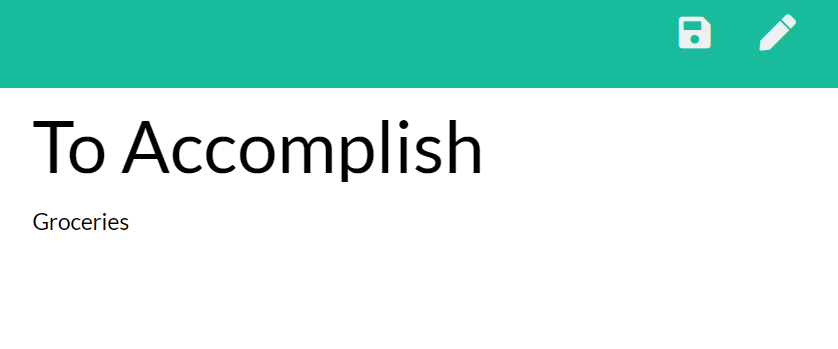
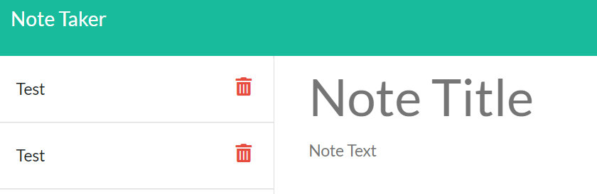

# Note Taker

Built with HTML, javascript, node, and deployed with Heroku.

URL of the deployed application: [Note Taking App](https://afternoon-falls-86265.herokuapp.com/)

URL of the GitHub repository: [Repository](https://github.com/rpdurk/NoteTaker)

## Table of Contents 

* [Description](#description)
* [View](#view)
* [Usage](#usage)
* [Built With](#built-with)
* [Credits](#credits)
* [License](#license)

## Description

>Time management is a critical skill to be successful in any endeavour.  Modern technology can however improve one's ability to manage time and therefore projects.  This note taking app is meant to allow an individual to create, save, and delete notes, thus improving their ability to manage their time and projects.

## View

To view the website, you can click [here](https://afternoon-falls-86265.herokuapp.com/).

## Usage and Key Features

In this application, the user can add, save, and delete notes.

If the user is interested in adding and saving a note, type in a title and the details.  A save icon will appear in the top right corner.  Simply click, and refresh the page to save the note. 

If you the notes are completed and added to the trash can, then locate the note on the left hand side, and click the trash can icon.

## Built With

* [HTML](https://html.spec.whatwg.org/) - Markup language used to define the structure of webpage.
* [javaScript](https://www.javascript.com/) - JavaScript language of the web.
* [node](https://nodejs.org/en/) - JavaScript  runtime environnement.
* [Heroku](https://www.heroku.com/home) - Website used to deploy data driven apps with managed services.

## License 

MIT License Copyright (c) 2020 Ryan Durk

